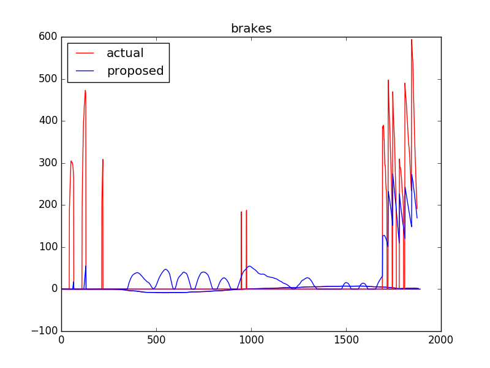

# Control Module

  - DBW Node
  - Waypoint follower

## DBW Node

The Drive By Wire node is in charge of moving the vehicle using the steering, throttle and break actuators. The node subscribes to the following nodes:

- /current_velocity
- /twist_cmd
- /vehicle/dbw_enabled


## Waypoint Follower

This node subscribes to `/final_waypoints` data and publishes `/twist_cmd` for the dbw node to use.

For validation, the project includes the [dbw_test.py](ros/src/twist_controller/dbw_test.py) which generates the following 3 files:

  - steers.csv
  - throttles.csv
  - brakes.csv

Execute it as follows to generate the csv files:

```bash
cd <project_location>
roslaunch ros/src/twist_controller/launch/dbw_test.launch
```

Then execute the script to plot the result.

```bash
cd <project_location>/ros/src/twist_controller/
python process_csv.py
```

The following files are generated

  - steers.png
  - throttles.png
  - brakes.png

Notice that you need to change <project_location> for the project current location in your local machine.

Results are:

### Steering


The proposed `steering` value almost matches the `actual` one. The only section it does not follow the `actual` value is after passing the `max_steer_angle` value 8 detailed in files [dbw.launch](./ros/src/twist_controller/launch/dbw.launch) and [dbw_sim.launch](./ros/src/twist_controller/launch/dbw_sim.launch). Notice the minimum goes to `steering` -8.

### Throttle


The `throttle` has a maximum value of 0.2 and proportial to it. That's why the proposed value cuts at 0.2 and does not follow the `actual` one.

### Brakes



The `brake` uses the `throttle` and `decel_limit` to control how much it should brake. Notice that as the maximum `throttle` is 0.2 (low value), it does not need an aggrestive brake control.