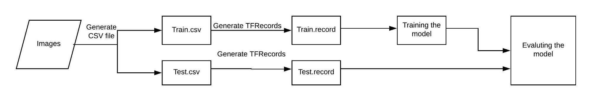
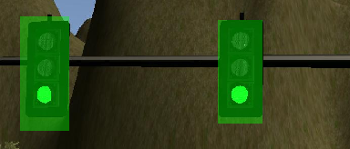
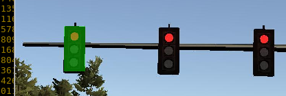
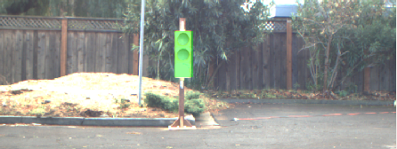
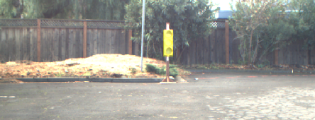
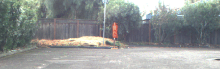

# Perception Module

The Perception Module will take an image from the camera and needs to detect traffic light position and colour. Main nodes are:

  - Obstacle Detection
  - Traffic Light Detection

## Obstacle Detection

For this project the are no obstacles on the road.

## Traffic Light Detection


We need to implement the traffic light detector to work on the simulator and real world case. To get started with the simulator, Udacity provides the actual status of the lights so that your implementation can cross check things. But we cannot rely on the real case.

To effectively detect the traffic lights we decided to retrain existing Neural Networks using the Transfer Learning approach. We selected the [TensorFlow object detection repository](https://github.com/tensorflow/models) as many of the models already detect 90 objects and create a bounding box on it's location.


We followed this pipeline to retrain and classify Red, Yellow, Green traffic lights:



Fore details on this process check the [Notes](notes.md) section.

The result of our SSD is a list of boxes with the detected light color, but unfortunately the SSD is not always absolutely accurate although most of the errors were in the simulator images, sometimes due to poor contrast or too small traffic lights.

In the simulator traffic lights come in sets of three. We used this fact to increase the accuracy of the detection process in this case:

  - We mandate a minimum 0.8 confidence in the box detection.

  - We only use boxes which are __long__. That means the height is more than 1.8 times width. This is a trial and error number to remove SSD box detection bad accuracy. 
  
  - With the remaining boxes we use a majority color criterium to select the __color__ of the __image__.
  
This is implemented in the __tl_classifier.py__ function :

```python

        confidence_cutoff = 0.8    # Modified from 0.6 -> 0.8. Seems better

        (boxes, scores, classes) = self.filter_boxes(confidence_cutoff, boxes, scores, classes)

        detected_value = TrafficLight.UNKNOWN

        box_coords = self.to_image_coords(boxes, height, width)
        number_of_boxes = np.array([0, 0, 0, 0])

        for(box, c, s) in zip(box_coords, classes, scores):
            r = (box[2]-box[0])/(box[3]-box[1])
            if r > 1.8 and (box[3] - box[1]) > 18.0:    # Relation > 1.8 and minim size 18
                number_of_boxes[int(c)] += 1

        

        if len(classes) > 0:
            color = np.argmax(number_of_boxes)
			
```


In short we need to follow these steps:

  - Is the car close to a traffic light waypoint?
  - Get an image and detect where traffic light is.
  - Classify as Red Yellow or Green.
  - Decide what to do next.
  

This is the resulting testing using the Simulator by means of the '/image_debug' topic enabled by default, a bounding box with the detected color is added to the image:




Using the traffic_light.bag file:





The notebook [check.ipynb](./Preparation/check.ipynb) was used to check the algorithm with some images.


## References

  - [Deep Dive into Object Detection with Open Images, using Tensorflow](https://blog.algorithmia.com/deep-dive-into-object-detection-with-open-images-using-tensorflow/)
  - [Introduction and Use - Tensorflow Object Detection API Tutorial](https://pythonprogramming.net/introduction-use-tensorflow-object-detection-api-tutorial/)
  - [TensorFlow Object Detection API tutorial - Training and Evaluating Custom Object Detector](https://becominghuman.ai/tensorflow-object-detection-api-tutorial-training-and-evaluating-custom-object-detector-ed2594afcf73)
